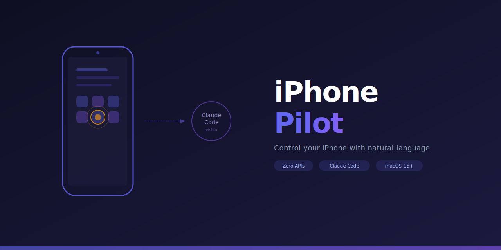

<div align="center">



<br>
<br>

**Control your iPhone with natural language via macOS iPhone Mirroring.**

No API keys. No cloud calls. Your mouse stays free. [Claude Code](https://docs.anthropic.com/en/docs/claude-code) is the brain.

[](LICENSE)
[](https://python.org)
[](https://support.apple.com/en-us/105097)
[](#how-it-works)

[Getting Started](#getting-started) · [Usage](#usage) · [How It Works](#how-it-works) · [Contributing](#contributing)

</div>

---

## Why?

iPhone Mirroring on macOS lets you see and interact with your iPhone from your Mac. But you still have to click around manually.

**iPhone Pilot** turns that into a programmable interface. You describe what you want in plain language, and Claude Code does the rest — it sees the screen, finds the right buttons, taps, swipes, and types for you.

**Your mouse and keyboard stay completely free.** All events are sent directly to the iPhone Mirroring process in the background using `CGEventPostToPid`.

```
> /iphone Open Settings and turn off Wi-Fi

Capturing screen...
I see the home screen. Tapping "Settings" at (163, 340)...
Settings is open. Tapping "Wi-Fi" at (163, 185)...
Wi-Fi settings. Tapping the toggle to turn it off...
Done — Wi-Fi is now off.
```

## Getting Started

### Prerequisites

| Requirement | Why |
|---|---|
| **macOS 15+** (Sequoia) | [iPhone Mirroring](https://support.apple.com/en-us/105097) support |
| **Python 3.11+** | Runtime |
| **Xcode Command Line Tools** | Compile the Swift helper (`xcode-select --install`) |
| **Claude Code** | The AI brain with native vision |

### Install

```bash
git clone https://github.com/xiapeli/iphone-pilot.git
cd iphone-pilot
make install    # Compiles Swift helper + creates venv + installs package

# Verify
source .venv/bin/activate
iphone-pilot status
```

Or step by step:

```bash
# 1. Compile the Swift event helper
swiftc -O -o helper/iphone_event helper/iphone_event.swift -framework Cocoa

# 2. Create venv & install
python3 -m venv .venv
source .venv/bin/activate
pip install -e .

# 3. Verify
iphone-pilot status
```

## Usage

### `/iphone` command in Claude Code (recommended)

Open iPhone Mirroring, then in Claude Code:

```
/iphone Open Instagram and like the latest post
/iphone Go to Settings > Wi-Fi
/iphone Send "hey!" on WhatsApp to the first chat
/iphone Take a screenshot of my iPhone
```

The `/iphone` skill handles the full autonomous loop:

```
capture screen → analyze with vision → execute action → verify → repeat
```

You can keep using your Mac normally while it works.

### CLI (manual & scripting)

Every action is also available as a standalone command:

```bash
# Connection
iphone-pilot status                          # Check iPhone Mirroring

# Screen
iphone-pilot screenshot                      # Capture → screenshot.png
iphone-pilot screenshot ~/Desktop/shot.png   # Capture → custom path

# Interactions (no mouse movement!)
iphone-pilot tap 163 340                     # Tap at coordinates
iphone-pilot swipe 163 600 163 200           # Swipe (x1 y1 → x2 y2)
iphone-pilot type "Hello world"              # Type text
iphone-pilot key return                      # Press key

# Navigation
iphone-pilot home                            # Home screen
iphone-pilot back                            # Go back
iphone-pilot scroll-down                     # Scroll down
iphone-pilot scroll-up                       # Scroll up

# Skills
iphone-pilot skills                          # List learned skills
```

## How It Works

```
┌──────────────────────────────────────────────────────┐
│                                                      │
│   "Open Settings"         Claude Code                │
│         │                 ┌──────────┐               │
│         ▼                 │  Native  │               │
│   ┌───────────┐  image    │  Vision  │               │
│   │screenshot │──────────▶│ Analysis │               │
│   └───────────┘           └────┬─────┘               │
│                                │                     │
│                          decides action              │
│                                │                     │
│                                ▼                     │
│                     ┌──────────────────┐             │
│                     │  iphone-pilot    │             │
│                     │  tap 163 340     │             │
│                     └────────┬─────────┘             │
│                              │                       │
│                  CGEventPostToPid (Swift)             │
│                     no cursor movement               │
│                              │                       │
│                              ▼                       │
│                     ┌──────────────────┐             │
│                     │ iPhone Mirroring │             │
│                     │    (macOS 15+)   │             │
│                     └──────────────────┘             │
│                                                      │
│   Then captures again to verify → loops until done   │
│                                                      │
└──────────────────────────────────────────────────────┘
```

### Key design decisions

1. **No API keys needed** — Claude Code's native vision analyzes screenshots directly. No Anthropic/OpenAI API calls.

2. **No mouse takeover** — A Swift helper sends `CGEvent` directly to the iPhone Mirroring process via `CGEventPostToPid`. Your cursor never moves.

3. **No heavy dependencies** — Zero Python packages required. Just stdlib + a compiled Swift binary + macOS native tools (`screencapture`).

### Tech stack

| Layer | Tool | Purpose |
|---|---|---|
| Brain | Claude Code | Sees screenshots, decides actions |
| Screen capture | `screencapture -R` | macOS native region capture |
| Window detection | `CGWindowListCopyWindowInfo` | Find window bounds (works in background) |
| Event injection | `CGEventPostToPid` (Swift) | Send tap/swipe/type to process without moving cursor |
| Coordination | Python CLI | Ties it all together |

## Skills System

iPhone Pilot learns from repetition. When a task succeeds, the action sequence is saved as a JSON skill:

```json
{
  "name": "open_wifi_settings",
  "command": "open settings and go to wifi",
  "steps": [
    {"action": "tap", "x": 163, "y": 340, "description": "Tap Settings"},
    {"action": "tap", "x": 163, "y": 185, "description": "Tap Wi-Fi"}
  ],
  "success_count": 3
}
```

After enough successful runs, skills replay directly without needing AI analysis — faster and offline.

```bash
iphone-pilot skills          # List all learned skills
ls skills/                   # Raw JSON files
```

## Project Structure

```
iphone-pilot/
├── .claude/
│   └── skills/iphone/         # /iphone command for Claude Code
├── helper/
│   └── iphone_event.swift     # Swift: CGEventPostToPid (no cursor movement)
├── iphone_pilot/
│   ├── config.py               # Constants and paths
│   ├── screen.py               # Screenshot capture (screencapture + CGWindowList)
│   ├── actions.py              # Tap, swipe, type (via Swift helper)
│   ├── agent.py                # Step executor, status, skill runner
│   ├── skills.py               # Skill learning system
│   └── main.py                 # CLI entry point
├── skills/                     # Learned skills (JSON)
├── Makefile                    # build / install / clean
├── CLAUDE.md                   # Claude Code project guide
├── CONTRIBUTING.md             # How to contribute
├── LICENSE                     # MIT
└── pyproject.toml              # Zero dependencies
```

## Roadmap

- [x] Core CLI (tap, swipe, type, screenshot)
- [x] Claude Code `/iphone` skill
- [x] Skill learning system
- [x] Background execution (no mouse takeover)
- [x] Swift `CGEventPostToPid` — no cursor movement
- [ ] Long press gesture
- [ ] Pinch to zoom
- [ ] Multi-display support
- [ ] App-specific skills library (community-contributed)
- [ ] Video recording of actions
- [ ] Skill sharing (import/export)

## Contributing

Contributions are welcome! See **[CONTRIBUTING.md](CONTRIBUTING.md)** for the full guide.

### Quick start for contributors

```bash
git clone https://github.com/xiapeli/iphone-pilot.git
cd iphone-pilot
make install
source .venv/bin/activate
iphone-pilot status
```

### Areas where help is needed

| Area | Description |
|---|---|
| **Gestures** | Long press, pinch, rotate support |
| **Multi-display** | Better window detection on multi-monitor setups |
| **Precision** | Improve tap/swipe coordinate accuracy |
| **Skills** | Better fuzzy matching for cached skills |
| **Testing** | Automated tests with mock screenshots |
| **Docs** | Usage examples, video tutorials |

## License

MIT — see [LICENSE](LICENSE).

---

<div align="center">

Built with Claude Code by [@xiapeli](https://github.com/xiapeli)

If this project is useful to you, consider giving it a ⭐

</div>
